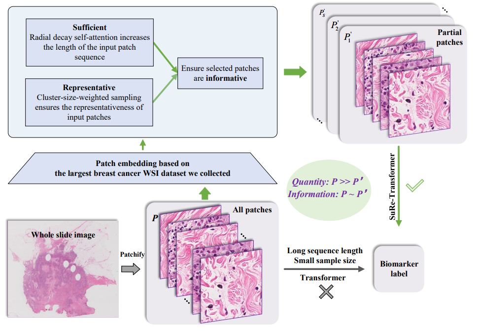
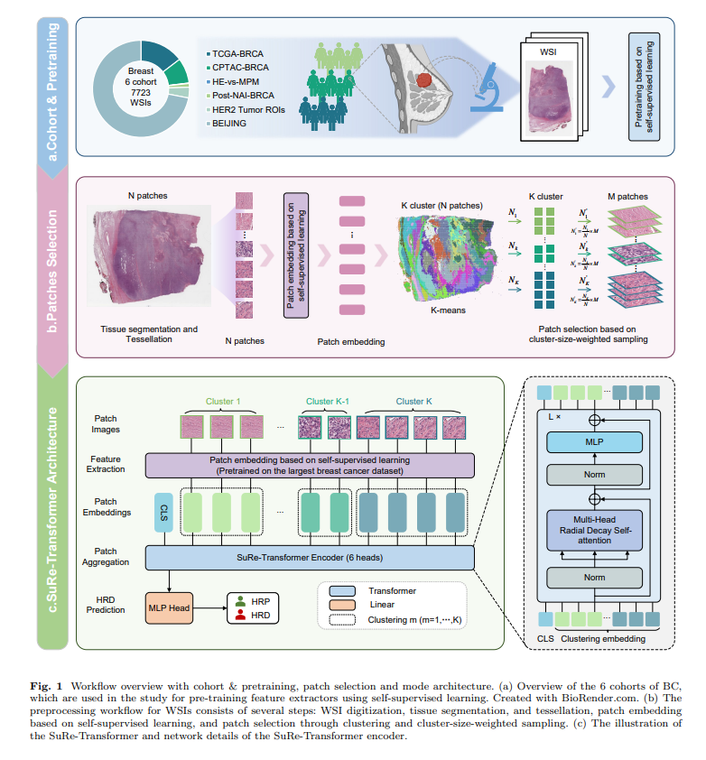

# SuRe-Transformer: Sufficient and Representative Transformer

 

- - -

### Dataset
* Training and internal validation: The WSIs used in training and internal validation are from TCGA (https://portal.gdc.cancer.gov/), open access to all. 
* External validation: we have collected a total of 192 breast cancer patients' data (WSI + HRD status) from the Beijing ChosenMed Clinical Laboratory Co. Ltd. Based on this dataset, we conduct external validation (train on TCGA, test on ChosenMed).
- - -

### get_DINO_features: Use DINO for patch embedding

* `get_feature.py`：Use the trained DINO for patch embedding.

### patch_clustering: Clustering patches in WSI 

* `featureClustering_dino_8K.py`：Clustering with the features extracted from DINO.
  
* `genFeature_multi_8K.py`：According to the WSI patch clustering results, randomly select patches to build SuRe-Transformer training set.

### Sufficient and Representative Transformer: SuRe-Transformer training

* `splits_k_fold.py`：Make and split training set, validation set and test set for SuRe-Transformer model.

* `train_k_fold_random.py`：Training the SuRe-Transformer model.

*  `test_k_fold_random.py`：Testing the SuRe-Transformer model.

 

- - - 
### Environments
* Python==3.10.9
* Ubuntu==18.04.5
* torch==2.0.0
* torchvision==0.15.0
* matplotlib==3.7.2
* numpy==1.22.3
* pandas==1.5.2
* Pillow==9.3.0
* scikit_learn==1.2.0
* scipy==1.8.1
* spams==2.6.5.4
* tensorboardX==2.6.2.2
* pytorch_lightning==1.9.3
* openslide_python==1.1.2
* einops==0.6.0
* dgl==1.1.2
* urllib3==1.26.14
* torchmetrics==0.11.4
- - -
If you have any questions, please contact Haijing Luan at luanhaijing@cnic.cn.

If you find our work useful in your research, please consider citing our paper at:

Luan H, Hu T, Hu J, et al. Breast cancer homologous recombination deficiency prediction from pathological images with a sufficient and representative Transformer[J]. npj Precision Oncology, 2025, 9(1): 1-14.
